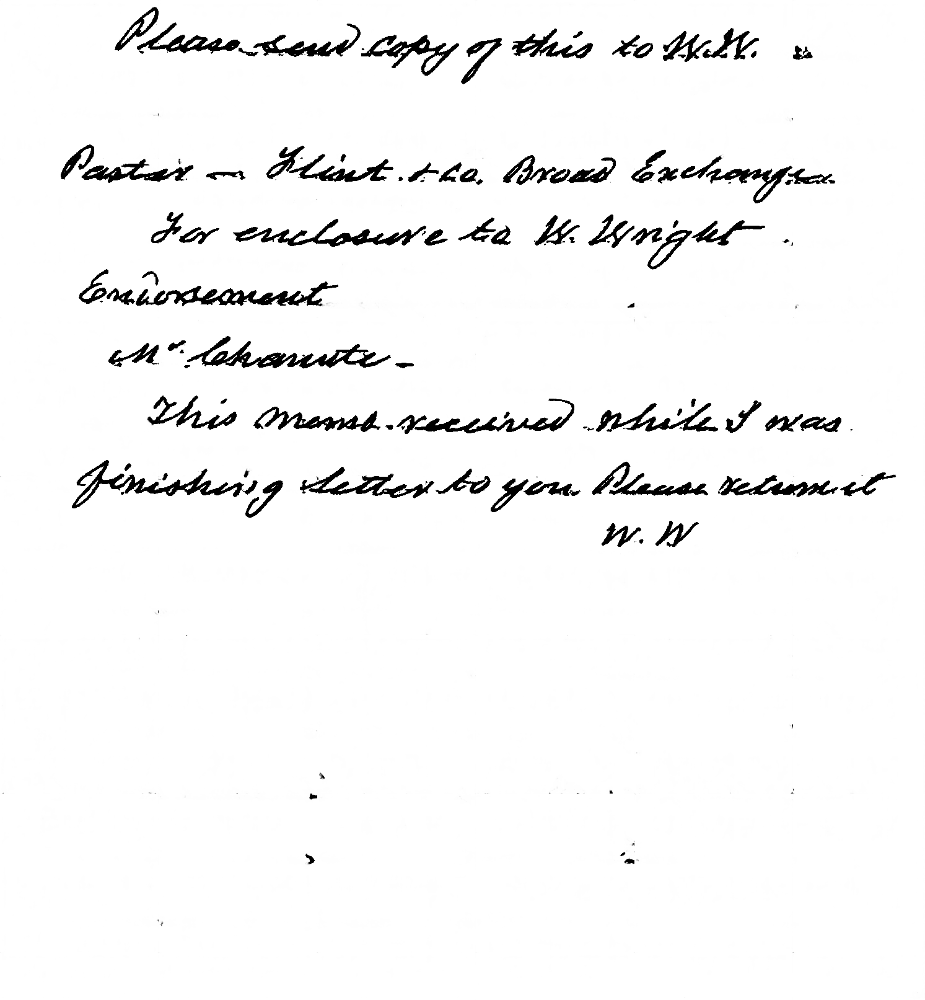
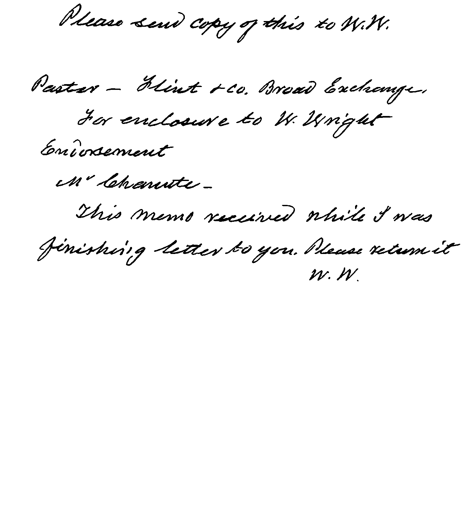
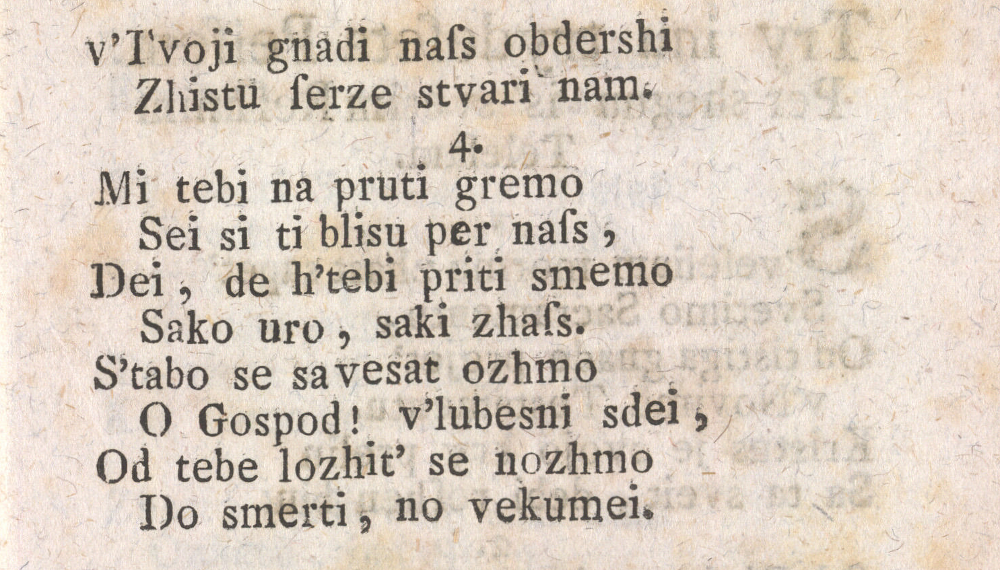
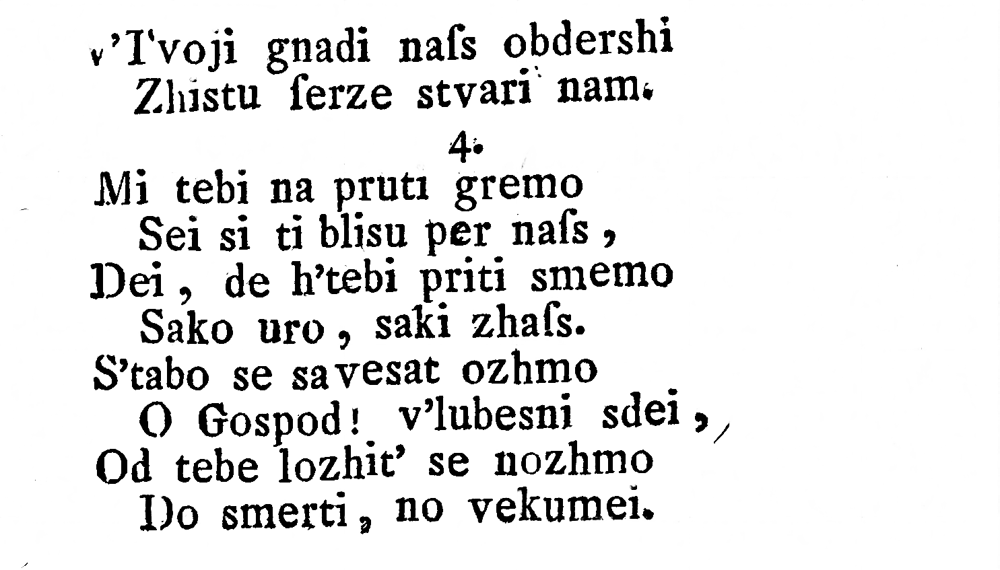
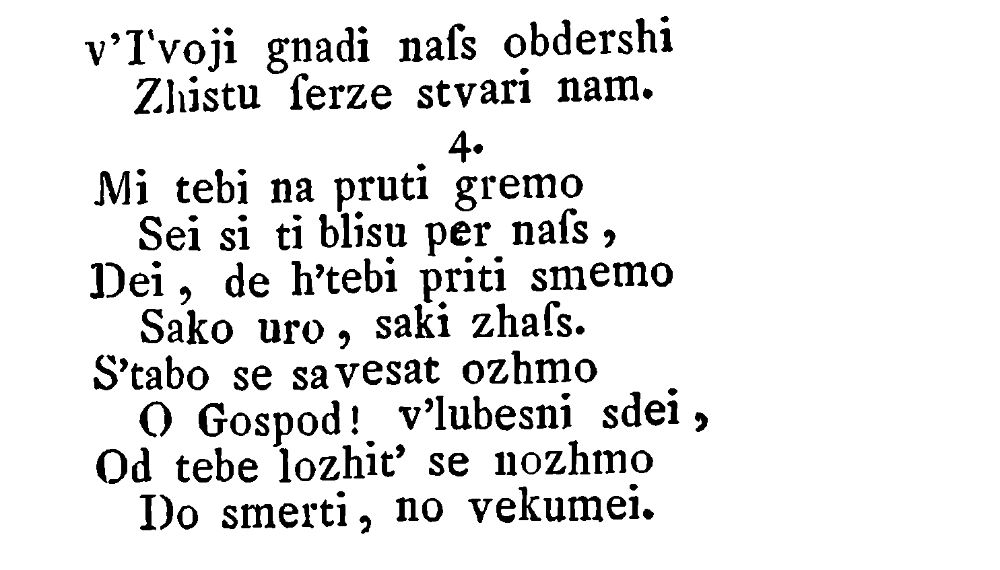
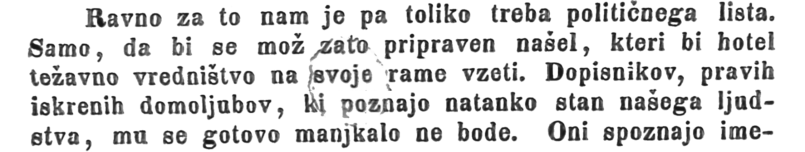
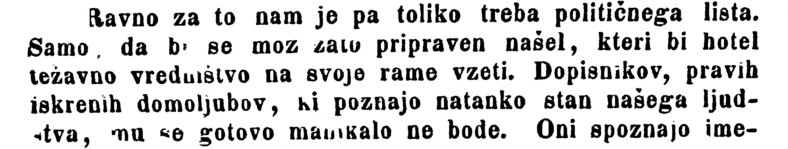

# Prerequisites
The research in the document enhancement problem was inspired by this [article](https://arxiv.org/pdf/2010.08764v1.pdf), where authors modify [GAN](https://arxiv.org/pdf/1406.2661v1.pdf) to the document enhancement problem via image-to-image approach. Our goal is to update some architecture elements of the model according to modern trends in order to enhance metrics. We calculate [PSNR](https://en.wikipedia.org/wiki/Peak_signal-to-noise_ratio) (Peak signal-to-noise ratio) as a metric on the [DIBCO2013](https://dib.cin.ufpe.br/#!/resources/dibco) dataset.

# Results
We provide both the qualitative and quantitative results. We use the DIBCO2013 as the validation dataset.

| MODEL | PSNR |
| ----- | ---- |
| Original GAN | 38.27 |
| Proposed | **52.72** | 

| EXAMPLES | INPUT | DE-GAN | OUR | GT |
| -------- | ----- | ------ | --- | -- |
| Example 1 |  |  |  |  |
| Example 2 |  |  |  |  |
| Example 3 |  |  |  |  |

# Setup
We use `Python3.10.13`.

1. Clone the repository:
```bash
git clone https://b.yadro.com/scm/~a.klykov/doc_enhancement.git
cd doc_enhancement
```

2. Set up `PYTHONPATH`:
```bash
export PYTHONPATH=${PWD}:${PYTHONPATH}
```

3. Install requirements:
```bash
pip install -r requirements.txt
```

# Training
To train run the following command:

```bash
python3 train.py --data_root <path/to/dataset/root/> \
                 --runs_root <path/to/logs/root/> \
                 --num_epoch <the number of epoch> \
                 --batch_size <the size of batch> \
                 --experiment_name <the name of experiments>
```

During the training the `./runs/logs/` with tensorboard logs and `./runs/weights/` with saved model weights directories will be created. We use the NVIDIA GeForce RTX 4090 for the training.

# Inference
To inference run the following command: 

```bash
python3 eval.py --path_to_image <path/to/image.bmp> \
                --save_dir <path/to/save/directory/>
```

During the inference the `./checkpoints` directory with the best model weights will be created. By default the generated image will be saved with the name of the original image. It is possible to specialize the name of generated image via the `save_dir` argument.